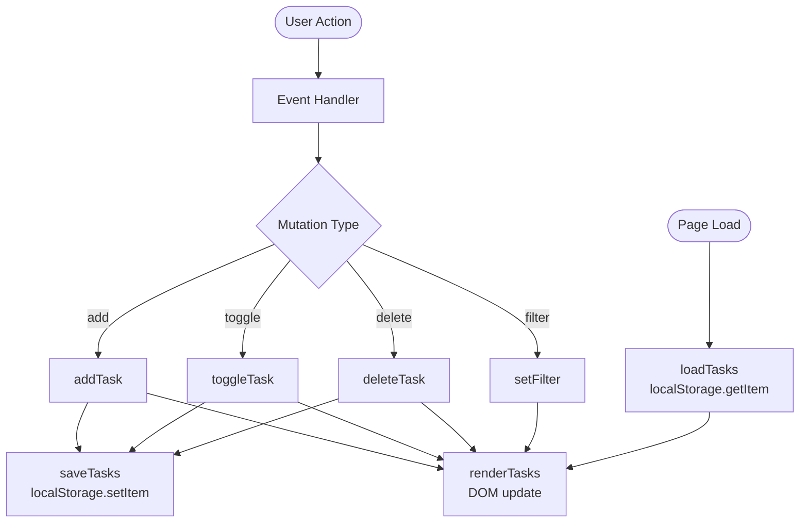

# Design Document — To Do List App

## Overview

The To Do List app is a single-page web application that runs by opening `index.html` directly in a browser. It uses no frameworks, no build step, and no backend. All state lives in memory while the page is open and is persisted to `localStorage` as JSON. The app lets users add, complete, delete, and filter tasks, with the full task list surviving page refreshes.

The implementation is spread across three flat files:

| File | Responsibility |
|---|---|
| `index.html` | Semantic markup and DOM structure |
| `style.css` | Visual design, layout, interactive states |
| `app.js` | All application logic, state management, DOM rendering |

---

## Architecture

The app follows a **unidirectional data flow** pattern without any framework:

```
User Action → State Mutation → Persist to localStorage → Re-render DOM
```

Every user interaction (add, toggle, delete, filter change) goes through a single cycle:

1. An event handler captures the user action.
2. The handler mutates the in-memory `tasks` array (and/or `currentFilter` string).
3. `saveTasks()` serializes and writes the updated state to `localStorage`.
4. `renderTasks()` performs a full DOM re-render of the task list based on the current state.

This keeps the DOM as a pure projection of state and avoids incremental DOM patching complexity.



### Design Decisions

- **Full re-render on every change**: Given the small scale of this app (no virtual DOM needed), recreating the task list `<ul>` on each state change is simple, correct, and avoids state synchronization bugs.
- **No module system**: All code lives in a single IIFE (or top-level module-style block) in `app.js` to avoid polluting the global scope while remaining compatible with direct `<script>` loading.
- **Defensive localStorage access**: Reads are wrapped in a `try/catch` to handle corrupted or missing data gracefully.

---

## Components and Interfaces

### HTML Structure

```html
<main id="app">
  <h1>To Do</h1>
  <section class="input-section" aria-label="Add a task">
    <input id="task-input" type="text" ... />
    <button id="add-btn">Add</button>
  </section>
  <section class="task-section">
    <ul id="task-list" role="list"></ul>
    <p id="empty-state" ...>Nothing to do. Add a task above.</p>
  </section>
  <footer class="filter-section" role="navigation" aria-label="Filter tasks">
    <button class="filter-btn" data-filter="all">All</button>
    <button class="filter-btn" data-filter="active">Active</button>
    <button class="filter-btn" data-filter="completed">Completed</button>
  </footer>
</main>
```

### JavaScript Functions

| Function | Signature | Description |
|---|---|---|
| `loadTasks` | `() → void` | Reads and parses tasks from localStorage on init |
| `saveTasks` | `() → void` | Serializes `tasks` array to localStorage |
| `addTask` | `(description: string) → void` | Validates, creates, and appends a new task |
| `toggleTask` | `(id: string) → void` | Flips a task's `completed` status |
| `deleteTask` | `(id: string) → void` | Removes a task by id |
| `setFilter` | `(filter: string) → void` | Updates `currentFilter` and re-renders |
| `getFilteredTasks` | `() → Task[]` | Returns the subset of `tasks` matching `currentFilter` |
| `renderTasks` | `() → void` | Rebuilds the task list DOM from current state |
| `renderFilterButtons` | `() → void` | Updates the active class on filter buttons |
| `createTaskElement` | `(task: Task) → HTMLElement` | Creates a single `<li>` element for a task |

### Event Wiring

| Event | Element | Handler |
|---|---|---|
| `click` | `#add-btn` | Calls `addTask` with input value |
| `keydown` (Enter) | `#task-input` | Calls `addTask` with input value |
| `change` | `.task-checkbox` (delegated) | Calls `toggleTask` with `data-id` |
| `click` | `.btn-delete` (delegated) | Calls `deleteTask` with `data-id` |
| `click` | `.filter-btn` (delegated) | Calls `setFilter` with `data-filter` |

Event delegation is used on the task list container to handle dynamically created task elements.

---

## Data Models

### Task Object

```js
{
  id: string,          // crypto.randomUUID() or Date.now().toString() fallback
  description: string, // trimmed, 1–500 characters
  completed: boolean,  // false = active, true = completed
  createdAt: number    // Date.now() timestamp, used for stable ordering
}
```

### Application State (in-memory, module-scoped)

```js
let tasks = [];          // Task[]  — ordered array, append-only from the user's perspective
let currentFilter = 'all'; // 'all' | 'active' | 'completed'
```

### localStorage Schema

```
Key:   'todo-tasks'
Value: JSON string — serialized Task[]

Example:
[
  { "id": "abc123", "description": "Buy groceries", "completed": false, "createdAt": 1700000000000 },
  { "id": "def456", "description": "Call dentist", "completed": true,  "createdAt": 1700000001000 }
]
```

A single consistent key (`'todo-tasks'`) is used for all read and write operations throughout the app's lifetime.

### Validation Rules

| Field | Rule |
|---|---|
| `description` (raw) | After trimming, length must be ≥ 1 and ≤ 500 characters |
| `description` (stored) | Already-trimmed value |
| `id` | Must be unique across all tasks |
| `completed` | Boolean only |

---

## Correctness Properties

*A property is a characteristic or behavior that should hold true across all valid executions of a system — essentially, a formal statement about what the system should do. Properties serve as the bridge between human-readable specifications and machine-verifiable correctness guarantees.*

### Property 1: Valid task addition grows the task list

*For any* task list in any state, and any non-empty string of 1–500 characters (after trimming), calling `addTask` with that description should result in the task list being exactly one element longer, with the last element having a description equal to the trimmed input.

**Validates: Requirements 1.1**

---

### Property 2: Invalid input is rejected and leaves the task list unchanged

*For any* string whose trimmed length is 0 (empty or whitespace-only) or whose length exceeds 500 characters, calling `addTask` should leave the task list at the same length and same contents as before the call.

**Validates: Requirements 1.2**

---

### Property 3: Toggle is its own inverse (round-trip)

*For any* task in the task list, calling `toggleTask` twice in succession should leave that task's `completed` status identical to its original value. Equivalently, calling `toggleTask` once on an active task produces a completed task, and calling it once on a completed task produces an active task.

**Validates: Requirements 2.1, 2.2**

---

### Property 4: Deleting a task removes it from the list

*For any* task list and any task within it, calling `deleteTask` with that task's id should result in a list that is exactly one element shorter, and does not contain any element with the deleted task's id.

**Validates: Requirements 3.1**

---

### Property 5: Every mutation is immediately reflected in localStorage (persistence round-trip)

*For any* sequence of task list mutations (add, toggle, delete), after each mutation, parsing the value stored at the `'todo-tasks'` localStorage key should produce an array that is deeply equal to the current in-memory `tasks` array.

**Validates: Requirements 1.4, 2.3, 3.2, 5.3**

---

### Property 6: "all" filter displays every task regardless of status

*For any* task list containing tasks in any mix of `completed` and `active` statuses, when `currentFilter` is `'all'`, `getFilteredTasks()` should return all tasks in the list without omission.

**Validates: Requirements 4.3**

---

### Property 7: Status filters show only tasks matching their condition

*For any* task list and any filter value of `'active'` or `'completed'`, `getFilteredTasks()` should return exactly and only the tasks whose `completed` field matches the filter's condition (`false` for `'active'`, `true` for `'completed'`). No task from the other status class should appear in the result.

**Validates: Requirements 4.4, 4.5**

---

### Property 8: A filter that matches no tasks produces the empty state

*For any* task list and any filter value, if `getFilteredTasks()` returns an empty array, then the rendered DOM should show the empty-state message "Nothing to do. Add a task above." and the task `<ul>` should contain no `<li>` elements.

**Validates: Requirements 3.3, 4.7**

---

### Property 9: Initialization loads the persisted task list

*For any* valid JSON task array previously written to the `'todo-tasks'` localStorage key, when the app initializes (calls `loadTasks`), the in-memory `tasks` array should be deeply equal to the array that was stored, and the rendered task list should reflect each persisted task.

**Validates: Requirements 5.1**

---

### Property 10: Every button without visible text has an aria-label

*For any* rendered state of the app, every `<button>` element in the DOM whose visible text content is empty or absent should have a non-empty `aria-label` attribute.

**Validates: Requirements 6.3**

---

## Error Handling

### localStorage Read Failure

`loadTasks` wraps `localStorage.getItem` and `JSON.parse` in a `try/catch`. If the stored value is missing, `null`, or malformed JSON, the app silently initializes with an empty task array. No error is surfaced to the user.

```js
const loadTasks = () => {
  try {
    const raw = localStorage.getItem(STORAGE_KEY);
    tasks = raw ? JSON.parse(raw) : [];
  } catch {
    tasks = [];
  }
};
```

### localStorage Write Failure

`saveTasks` calls `localStorage.setItem` inside a `try/catch`. If the write fails (e.g., storage quota exceeded), the failure is caught silently. The in-memory state remains valid; only persistence is affected. This is an acceptable tradeoff for an app of this scope.

### Input Validation

`addTask` performs synchronous validation before any mutation:

1. Trim the input string.
2. If `trimmed.length === 0` or `trimmed.length > 500`: return early without modifying `tasks`.
3. Otherwise: create a new Task object, push to `tasks`, call `saveTasks`, call `renderTasks`, clear the input field, and return focus to it.

No error messages are shown to the user for invalid input in the initial scope — the add action simply does nothing. A future iteration could add an inline validation hint.

### Missing `data-id` on Events

Event handlers that read `data-id` from delegated events should guard against missing attributes. If `dataset.id` is absent or doesn't match any task, the handler returns early without mutating state.

---

## Testing Strategy

This feature is a DOM-and-state application. PBT (property-based testing) is appropriate for the pure logic layer (`addTask`, `toggleTask`, `deleteTask`, `getFilteredTasks`, `saveTasks`/`loadTasks` with a mocked localStorage). DOM rendering and CSS-dependent behaviors are better covered by example-based and integration tests.

### Unit Tests (example-based)

Focus on specific behaviors and edge cases:

- `addTask` with a 1-character description (minimum valid)
- `addTask` with a 500-character description (maximum valid)
- `addTask` with a 501-character description (rejected)
- `addTask` with a whitespace-only string (rejected)
- `addTask` clears the input field and returns focus after success
- `toggleTask` on an active task sets `completed: true`
- `toggleTask` on a completed task sets `completed: false`
- `deleteTask` on the only item in a list produces an empty list
- `loadTasks` with `null` in localStorage initializes an empty array
- `loadTasks` with malformed JSON initializes an empty array
- Default filter is `'all'` on initialization
- Filter button for active filter receives the active CSS class indicator
- Empty-state message is present when task list is empty

### Property-Based Tests

Use a property-based testing library (e.g., [fast-check](https://github.com/dubzzz/fast-check) loaded via CDN `<script>` tag in the test harness). Each test runs a minimum of **100 iterations**.

Each test is tagged with a comment in the format:
`// Feature: todo-list-app, Property N: <property text>`

| Property | Generator Strategy |
|---|---|
| P1 — Valid addition grows list | Generate random non-empty strings ≤ 500 chars; assert list length +1 and correct description |
| P2 — Invalid input rejected | Generate whitespace-only strings and strings > 500 chars; assert list unchanged |
| P3 — Toggle round-trip | Generate random task lists; pick a random task; toggle twice; assert status unchanged |
| P4 — Delete removes task | Generate random task lists (length ≥ 1); pick a random task id; delete; assert absent |
| P5 — Mutation persistence round-trip | Generate random sequences of add/toggle/delete; after each, parse localStorage and compare to in-memory state |
| P6 — "all" filter returns everything | Generate random task lists with mixed statuses; assert `getFilteredTasks('all').length === tasks.length` |
| P7 — Status filter correctness | Generate random task lists; assert every result from `getFilteredTasks('active')` has `completed === false` and vice versa |
| P8 — Empty filter shows empty state | Generate task lists and a filter that matches none; assert empty-state DOM is visible |
| P9 — Init loads persisted list | Generate random task arrays; write to localStorage; call `loadTasks`; assert in-memory array deeply equals stored array |
| P10 — Buttons without text have aria-label | Enumerate all rendered `<button>` elements; assert those with no text content have `aria-label` |

### Accessibility Tests

- Run [axe-core](https://github.com/dequelabs/axe-core) (CDN) on the rendered page in each filter state and verify zero violations.
- Manually verify Tab order: Input → Add → task checkboxes → delete buttons → filter tabs.
- Manually verify focus rings are visible on all interactive elements.
- Verify contrast ratios for the defined color pairs against WCAG 2.1 AA (4.5:1 for normal text, 3:1 for completed-text muted gray against white surface).
